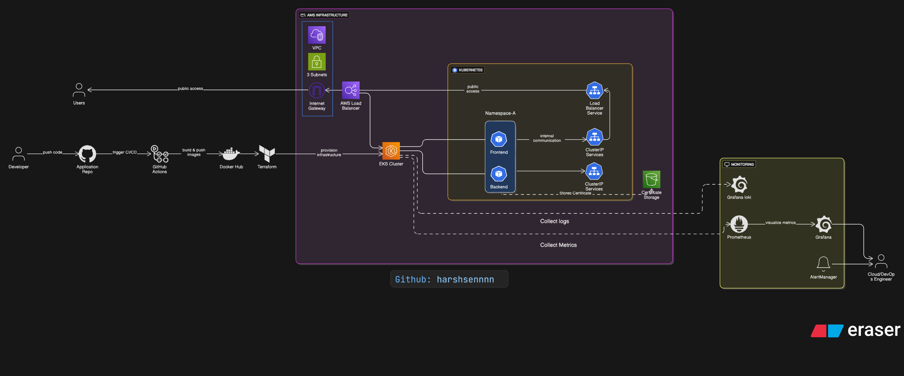

# DevOps Certificate Generator

This project focuses on creating a streamlined solution for generating Internship Certificates from user-selected Template. It features a user-friendly `React.js` front end for template selections and details input, a robust `GO` backend for certificate generation, and a secure storage system for saving the generated codes.

- `Front-End Container:` User-facing website for certificate template selection.
- `API Container:` Backend service for certificate generation.
- `Storage Container:` Secure storage for generated certificates.

# Cloud & DevOps Practices

- **`Docker`**: Used for containerizing the front-end (React.js) and API (Go) to ensure consistent deployment across environments.

- **`GitHub Actions`**: Implements CI/CD pipelines to automate the deployment of containers when source code changes occur.

- **`Terraform`**: Manages and provisions cloud infrastructure, specifically creating a Kubernetes cluster using Infrastructure as Code (IaC).

- **`Kubernetes`**: Orchestrates the deployment and management of containerized applications, ensuring scalability and high availability.
  - **`KIND(Kubernetes in Docker)`** Deploying application to test the functionality localy using Kind Cluster. 
  - **`AWS EKS`**: Deploying the application on prodcution using AWS EKS cluster. 

- **`AWS S3`**: Provides secure storage for generated QR codes, allowing for persistent data storage and easy accessibility.

- **`Prometheus`**: Monitors container and system metrics, offering real-time insights for performance and operational monitoring.

- **`Grafana`**: Visualizes metrics collected from Prometheus and other sources, enhancing observability and aiding in performance monitoring and troubleshooting.

## Project Workflow

  

## End to End CI/CD Pipeline

