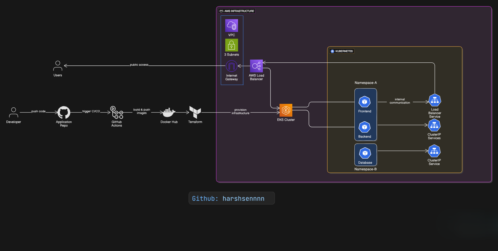

# DevOps Certificate Generator

This project focuses on creating a streamlined solution for generating Internship Certificates from user-selected Template. It features a user-friendly `React.js` front end for template selections and details input, a robust `GO` backend for certificate generation, and a secure storage system for saving the generated codes.
The application is split into decoupled components to ensure scalability and ease of deployment:

## Project Architecture

  Frontend (React.js): A user-friendly interface for selecting templates and inputting intern details.

  Backend (Go Microservice): A high-concurrency API responsible for processing data and generating PDF/Image certificates.

  Storage (AWS S3): Secure, persistent storage for generated certificates and assets.

  Infrastructure: Automated provisioning and orchestration using Terraform and Kubernetes (EKS/KIND/MicroK8s).
    
# Cloud & DevOps Practices

- **`Docker`**: Used for containerizing the front-end (React.js) and API (Go) to ensure consistent deployment across environments.

- **`GitHub Actions`**: Implements CI/CD pipelines to automate the deployment of containers when source code changes occur.

- **`Terraform`**: Manages and provisions cloud infrastructure, specifically creating a Kubernetes cluster using Infrastructure as Code (IaC).

- **`Kubernetes`**: Orchestrates the deployment and management of containerized applications, ensuring scalability and high availability.
  - **`KIND(Kubernetes in Docker)`** Deploying application to test the functionality localy using Kind Cluster. 
  - **`AWS EKS`**: Deploying the application on prodcution using AWS EKS cluster.
  - **`K3s`**: Deploying the application on lightweight, single-node Kubernetes using MicroK8s for local development or edge environments.

- **`AWS S3`**: Provides secure storage for generated QR codes, allowing for persistent data storage and easy accessibility.

- **`Prometheus`**: Monitors container and system metrics, offering real-time insights for performance and operational monitoring.

- **`Grafana`**: Visualizes metrics collected from Prometheus and other sources, enhancing observability and aiding in performance monitoring and troubleshooting.


## Project Workflow

<div align="center">
  
</div>

## End to End CI/CD Pipeline


##  Blue Deployment



## Quick Start with Docker 

This is the fastest way to get the application running on your local machine.

### Prerequisites

- Docker Desktop / Docker Daemon installed on your machine
- Git (to clone the repository)

### Steps to Run with Docker

1. **Clone the repository**
   ```bash
   git clone <repository-url>
   cd DevOps-Certificate-Generator
   ```

2. **First-time setup**
   ```bash
   docker compose up --build
   ```
   This command will:
   - Build all container images
   - Create necessary networks
   - Start all services
   - The frontend will be available at http://localhost:80
   - The backend API will be available at http://localhost:8081 and http://localhost:8082

3. **Subsequent runs**
   ```bash
   docker compose up
   ```
   Use this command when you haven't made any changes to the Dockerfile or dependencies.

4. **Stop the application**
   ```bash
   docker compose down
   ```
   This will stop and remove all containers, but preserve your images.

### Additional Docker Commands

- To view logs of a specific service:
  ```bash
  docker compose logs frontend  # For frontend logs
  docker compose logs api-gateway   # For backend logs
  docker compose logs pdf-generator   # For backend logs
  ```

- To rebuild a specific service:
  ```bash
  docker compose up --build frontend  # Rebuild frontend only
  docker compose up --build pdf-generator   # Rebuild pdf-generator microservice only
  docker compose up --build api-gateway   # Rebuild api-gateway only
  ```

- To remove all containers and images (clean slate):
  ```bash
  docker compose down --rmi all
  ```
